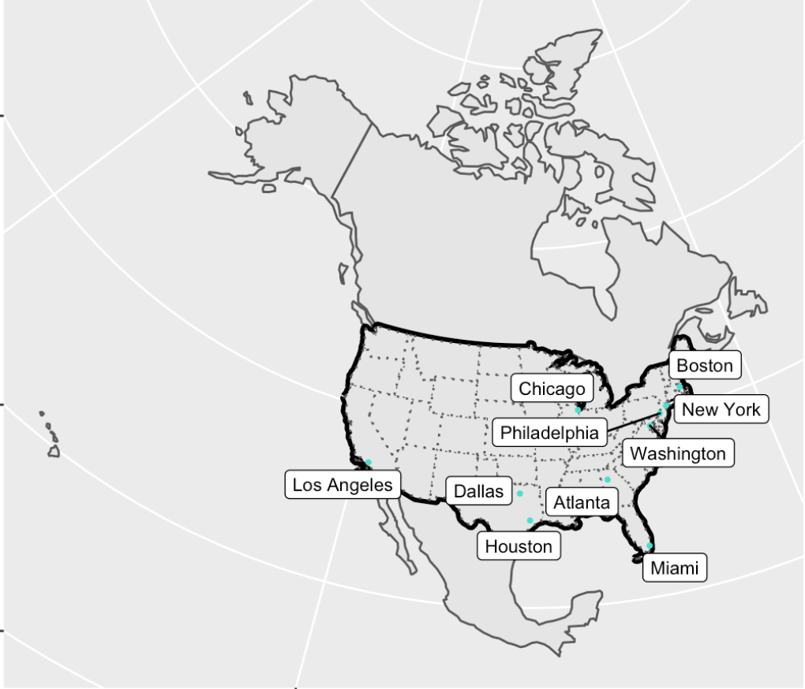
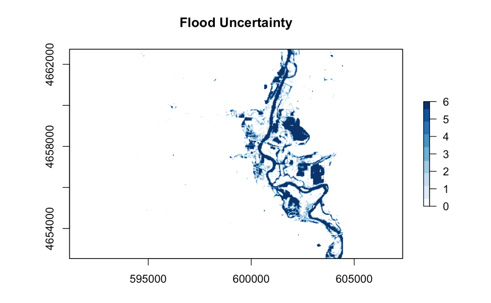

In the summer before my senior year of college, I took a GIS course that allowed me to learn about R and its applications, especially in relation to GIS. Below I have accumulated links to all of my projects that exemplify the skills I have learned over these trying weeks. 

## Lab 01: Data Science Workflows

[For our first lab assignment, I was instructed to build individualized websites.](https://aineroonan.github.io/)

1. I first had to understand how to properly link my code within RStudio to Github, including my repository. 
2. I had to learn about different functions for creating a website, such as inserting hyperlinks. 
3. I had to make the website my own with personalized details, and I am proud of what I have created.

****

## Lab 02: Data Wrangling

[For our second lab assignment, I took actual data about covid cases and manipulated the data for analysis.](https://aineroonan.github.io/geog-176A-labs/lab-02.html)

1. I found this week's lab particularly challenging, but I was able to effectively mutate new variables, such as cases per capita, in order to explore the data from new perspectives. 
2. I was also able to join two data sets together in order to consolidate multiple aspects, allowing me to expand my analysis or understanding. 
3. I also created multiple graphs, both faceted or unfaceted, that allowed me to represent information through an organized and visual medium. 

**** 

## Lab 03: Projections, Distances, and Mapping

[Our third lab helped us to explore spatial data visually as I viewed cities and their distances to borders.](https://aineroonan.github.io/geog-176A-labs/lab-03.html)

1. The main focus of our lab this week was to compare the distances between different places, this is helpful as the majority of citizens within the United States live near a border. 
2. I first had to define the boundaries of CONUS and its surrounding states, and then lay over the cities. 
3. Next, I compared the distances between different states, Mexico, and Canada, which allowed me to test our skills through recreating similar maps. 
4. I then studied a real world application as I explored how there may be different laws closer to borders. Our ability to spatially represent the populations of cities and their distances to borders then gains applicable knowledge. 

****

## Lab 04: Tesselations, Spatial Joins, and Point-in-Polygon

[Next, I learned another way to visualize data through tesselations.](https://aineroonan.github.io/geog-176A-labs/lab-04.html)

1. I learned how to code different tesselations with or without anchor points. 
2. I understand the different types of tesselations and how I can interpret information through different forms. 
3. I then applied my knowledge to real world situations where we analyzed the different reasons for dams and was able to analyze their locations. 

**** 

## Lab 05: Raster Analysis

[My penultimate lab addressed raster stacks and how to work with them.](https://aineroonan.github.io/geog-176A-labs/lab-05.html)

1. This lab tested our skills with what I already knew as to identify an AOI, I first needed to know how to read in csv data, structure it spatially with sf and CRS, filter it, and then finally transform the projection. 
2. I then used the getlandsat package to filter our data to specifically target scenes that match my date and bounding box. 
3. Using the landsat images allows me to view the terrain with aspects not visible to the naked eye, so I have more information that can be isolated to analyze. 

**** 

## Lab 06: Terrain Analysis

[My final lab!](https://aineroonan.github.io/geog-176A-labs/lab-06.html)

1. I had a lot of difficulties with this lab and it's code, but I did my best to work through the issues to the best of my ability. 
2. We first had to find the flood data and then filter it to a form that is conducive to my desired form of analysis. 
3. This lab taught me how to analyze flood risks by running simple raster analysis that give a lot of depth.  

