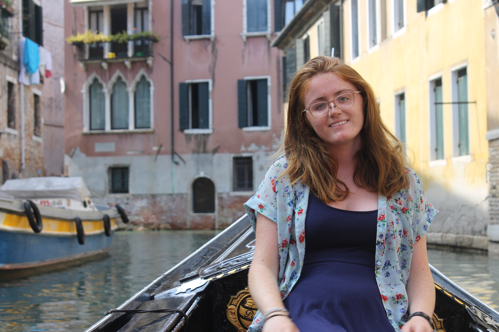
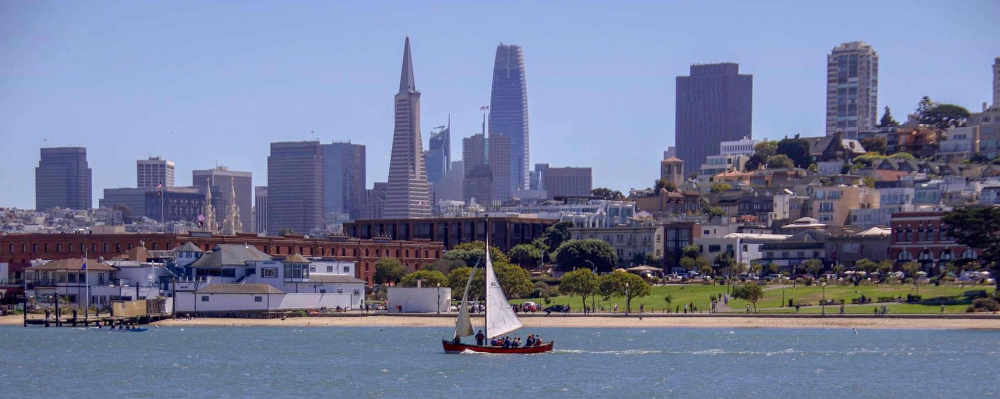

  

# Hi, I'm Aine Roonan! 

I am currently in my fourth year at UCSB and majoring in Political Science with a minor in Spatial Studies. My coursework  has laid a strong foundation for me to enter the professional workforce. I have recently completed a course that has given me an incredibly strong background in GIS. My studies prepared me for a supportive position within an office or organization as I am incredibly organized and have a history of customer service. I have always been an incredibly organized person and have experience as the secretary of my university’s sailing team and have organized and managed service projects and trips while still in high school. These experiences taught me how to manage multiple aspects to a project and how to properly plan ahead and think through all parts of a project. 

When I was 13, I began sailing on the SF Bay. I joined [SSS Viking](https://www.facebook.com/SSSViking/), an all female ship that sailed on a historical wooden whaleboat that was built in the 1930s. This program increased my already strong love of nature and especially our environment. In the future, I hope to be able to contribute in some way to fighting against the degradation of our natural resources and our environment through policy or other work. <i class="fas fa-anchor" style="color:red;"></i>
 